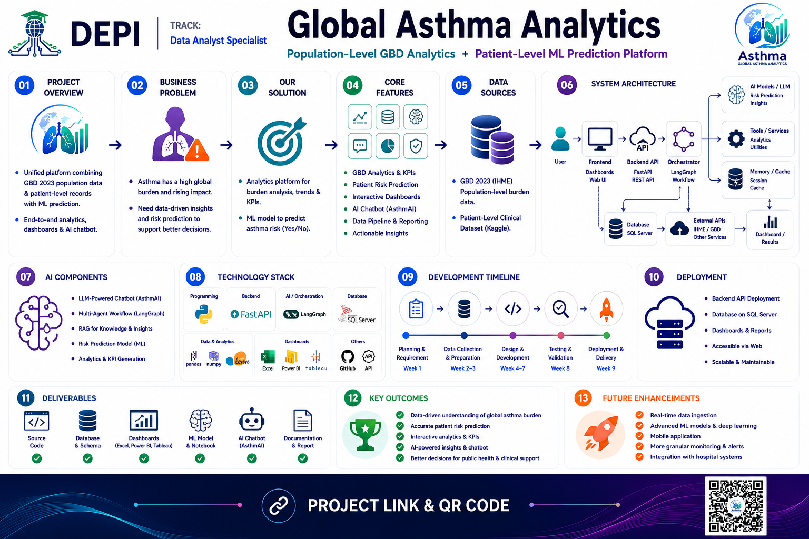

<div align="center">


# Global Asthma Analysis Platform

### DEPI Round 4 — AST Group | Data Analytics Track | Group ONL4_DAT1_S4

[](https://python.org)
[](https://powerbi.microsoft.com)
[](https://tableau.com)
[](https://microsoft.com/excel)
[](https://microsoft.com/sql-server)

---

*The Story of Saving Lives with Numbers.*

[Overview](#overview) • [Problem Statement](#problem-statement) • [Our Solution](#our-solution) • [Structure](#Project-Structure) • [Datasets Resource](#datasets) • [Dashboards](#dashboards) • [ML Models](#machine-learning) • [AI Chatbot](#ai-chatbot) • [Team](#team)

</div>

---

## Project Overview

Asthma is one of the most common chronic respiratory diseases worldwide,
affecting over **262 million people** across all age groups and placing a
significant burden on healthcare systems globally.

This platform integrates:

- **Global Burden of Disease (GBD 2023)** population-level analytics
- **Patient-level Machine Learning** prediction & risk assessment
- **Interactive Dashboards** — Power BI, Tableau & Excel
- **AI-powered Healthcare Chatbot** — AsthmAI (Gemini API)
- **SQL Server** data warehouse
  
---

## Problem Statement

Asthma remains a major global health burden, yet the data describing it is
scattered, inconsistent, and rarely turned into something decision-makers can
actually act on:

- **Fragmented data** — population-level burden statistics (GBD) and
  patient-level clinical data live in completely separate sources, in
  different shapes, at different granularities, with no shared view.
- **Messy, inconsistent raw data** — the GBD data alone arrives split across
  five separate yearly CSV exports (1990–1995, 2000–2005, 2010–2015,
  2019–2021, 2023), with mixed aggregate/detail age bands and no explicit
  "Both sexes" row, making direct analysis error-prone.
- **No single, trustworthy view** — public health teams, students, and
  researchers have no easy way to compare countries, track trends across
  decades, or understand which populations and risk factors matter most.
- **Limited accessibility** — the people who could benefit most from this
  data (students, healthcare communicators, non-technical stakeholders)
  don't have the technical background to query raw datasets or interpret
  statistical models themselves.
- **No early, personalized risk insight** — beyond population-level
  statistics, there is no simple way for an individual to get an
  approximate, explainable estimate of their own asthma risk based on
  known lifestyle and environmental factors.

## Our Solution

The Global Asthma Analysis Platform addresses each of these gaps directly:

- **Unified, verified dataset** — we sourced and merged all five raw GBD
  yearly CSVs into a single, verified **304,776-row** dataset spanning
  **204 countries** and **1990–2023**, cross-checked against external
  sources for accuracy, and handled structural quirks (mixed age bands,
  missing "Both sexes" rows via LOD calculations) so downstream analysis is
  reliable.
- **Multi-tool BI layer** — the same clean data is surfaced through three
  complementary BI tools (Power BI, Tableau, Excel), so different audiences
  can explore trends, compare countries, and drill into KPIs in whichever
  tool fits their workflow.
- **Patient-level ML pipeline** — a separate clinical dataset (2,392
  patients, 28 features) powers five trained ML models to identify the
  strongest predictors of an asthma diagnosis, with SHAP explainability so
  results are interpretable, not just accurate.
- **AsthmAI chatbot** — a bilingual (Arabic/English, RTL-supported)
  that lets anyone ask natural-language questions
  about the GBD data, generate charts on demand, and receive an ML-based
  personal risk estimate with SHAP-based explanations. The chatbot now runs
  on a dedicated **FastAPI backend** that queries **SQL Server stored
  procedures** directly — no CSV uploads required.
- **Governed data layer** — a SQL Server schema, views, and stored
  procedures (managed through **SSMS**) give the whole platform a
  consistent, queryable source of truth behind the dashboards and chatbot.

Together, these pieces turn a fragmented, hard-to-access global health
dataset into an accessible, explainable, and actionable analytics platform.

---

## Key Highlights

| Feature | Details |
|---|---|
| Countries analyzed | 204 countries |
| Time period | 1990 – 2023 |
| GBD dataset rows | 304,776 rows |
| Patient records | 2,392 patients · 28 features |
| ML models | 5 algorithms compared |
| Dashboards | Power BI + Tableau + Excel |
| AI Chatbot | FastAPI backend |
| Database Tooling | SQL Server Management Studio (SSMS) |
| Program | DEPI Round 4 · AST Group |

---

## Project Structure

```
Global-Asthma-Analysis/
│
├── Data/
│   ├── Meta Data/
│   │   └── meta Data.xlsx
│   ├── processed/
│   │   ├── GBD_Asthma_Final.csv
│   │   └── asthma_cleaned.csv
│   └── raw/
│       ├── 1990-1995.csv
│       ├── 2000-2005.csv
│       ├── 2010-2015.csv
│       ├── 2019-2021.csv
│       ├── 2023.csv
│       ├── GBD_Asthma_Final.csv
│       └── asthma_disease_data_realistic.csv
│
├── Logo/
│   ├── logo.png
│   └── logo1.png
│
├── Python/
│   ├── Asthma_Analytics.py
│   └── README.md
│
├── Research/
│   ├── README.md
│   └── The Integration of Advanced Data Analytics in Asthma Management.pdf
│
├── chatbot/
│   ├── Chat GBD Just/
│   │   └── GBD.html
│   ├── images/
│   ├── app.js
│   ├── global-analysis.js
│   ├── index.html
│   ├── patient-ml.js
│   └── styles.css
│
├── dashboards/
│   ├── EXCEL/
│   │   ├── Screans/
│   │   ├── Asthma_Dashboard.xlsx
│   │   └── Cleaned Data and Dashboards.xlsx
│   ├── Power Bi/
│   │   ├── Screanshots/
│   │   ├── GBD final project.pbix
│   │   └── asthma_disease_data_realistic.pbix
│   └── Tableau/
│       ├── Screans/
│       ├── GDB Asthma Analysis.twb
│       ├── GDB Asthma Analysis.twbx
│       └── ~GDB Asthma Analysis__31968.twbr
│
├── database/
│   ├── load/
│   │   ├── 07_load_data_template.sql
│   │   └── 08_verify_everything.sql
│   ├── schema/
│   │   ├── 00_drop_all.sql
│   │   ├── 01_create_database_and_schemas.sql
│   │   ├── 02_create_tables_gbd.sql
│   │   ├── 03_create_tables_patient.sql
│   │   └── 04_seed_reference_data.sql
│   ├── stored_procedures/
│   │   └── sp_asthma_summary.sql
│   ├── views/
│   └── ERD.png
│
├── docs/
│   ├── Global_Asthma_Analytics_Documentation.docx
│   ├── Project_Documentation.docx
│   └── SQL.pdf
│
├── notebooks/
│   ├── EDA Python Gen Charts/
│   ├── 01_Data_Cleaning.ipynb
│   ├── 03_EDA_Patient.ipynb
│   ├── 04_Machine_Learning.ipynb
│   ├── 05_Model_Evaluation.ipynb
│   └── GBD_Asthma_EDA.ipynb
│
├── reports/
│   ├── Asthma Presentation Project.pdf
│   └── Asthma Presentation Project.pptx
│
├── Final Chat bot/
│   ├── Screen Shots/
│   │   ├── APIs.png
│   │   ├── Ask AI depend on Procedures in Sql and Data.png
│   │   ├── GBD Arabic Dark Mode.png
│   │   ├── GBD Arabic Light Mode.png
│   │   ├── GBD English Dark Mode.png
│   │   ├── Ml predict.png
│   │   ├── patient Data and Predict.png
│   │   └── procedures in SQl.png
│   ├── backend/
│   │   ├── chat_context.py
│   │   ├── database.py
│   │   ├── llm_service.py
│   │   ├── main.py
│   │   ├── ml_service.py
│   │   └── requirements.txt
│   ├── frontend/
│   └── README.md
├── src/
│   └── models/
│       ├── X_test.csv
│       ├── X_test_scaled.csv
│       ├── X_train.csv
│       ├── X_train_scaled.csv
│       ├── best_model.pkl
│       ├── best_model_name.txt
│       ├── decision_tree.pkl
│       ├── logistic_regression.pkl
│       ├── random_forest.pkl
│       ├── scaler.pkl
│       ├── svm.pkl
│       ├── xgboost.pkl
│       ├── y_test.csv
│       └── y_train.csv
│
└── README.md
```

---

## Datasets

### 1. Global Burden of Disease (GBD 2023)
> Source: [IHME — Institute for Health Metrics and Evaluation](https://vizhub.healthdata.org/gbd-results/)

| Column | Type | Description |
|---|---|---|
| `measure_name` | text | Deaths / Prevalence / Incidence / DALYs / YLDs |
| `location_name` | text | Country name (204 countries) |
| `sex_name` | text | Male / Female |
| `age_name` | text | 0-14 / 15-49 / 50-69 / 70+ / All ages / Age-std |
| `metric_name` | text | Number / Percent / Rate |
| `year` | int | 1990 / 1995 / 2000 / 2005 / 2010 / 2015 / 2019 / 2021 / 2023 |
| `val` | float | Central estimate value |
| `upper` | float | Upper confidence interval |
| `lower` | float | Lower confidence interval |

- **Small Note:** When `metric_name = "Percent"`, multiply `val × 100` for display.
Example: `val = 0.052` → `5.2%`
- **Stats:** +300K Rows in global patients

  > Another Source help to Insights : [ourworldindata.org](https://ourworldindata.org/grapher/asthma-prevalence)

---

### 2. Asthma Disease Dataset (Patient Level)
> Source: [Kaggle — Asthma Disease Dataset](https://www.kaggle.com/datasets/rabieelkharoua/asthma-disease-dataset)

| Category | Features |
|---|---|
| Demographics | Age, Gender, Ethnicity, EducationLevel |
| Lifestyle | BMI, Smoking, PhysicalActivity, DietQuality, SleepQuality |
| Environmental | PollutionExposure, PollenExposure, DustExposure |
| Medical History | FamilyHistoryAsthma, HistoryOfAllergies, Eczema, HayFever, GastroesophagealReflux |
| Lung Function | LungFunctionFEV1, LungFunctionFVC |
| Symptoms | Wheezing, ShortnessOfBreath, ChestTightness, Coughing, NighttimeSymptoms, ExerciseInduced |
| **Target** | **Diagnosis** (0 = No Asthma, 1 = Asthma) |

**Stats:** 2,392 patients · 124 diagnosed (5.2%) · Age range 5–79

---

## Dashboards

### Power BI Dashboard
- World map: Prevalence by country
- Deaths trend: 1990–2023
- Top 10 countries bar chart
- DALYs by age group (donut)
- Male vs Female comparison
- KPI cards: Deaths / Prevalence / DALYs / Incidence
- Slicers: Year · Measure · Metric · Sex · Age · Location

### Tableau Dashboard
-  Heatmap: Countries × Years
-  World map: Prevalence, Deaths & incidance by country
-  Bubble chart: Incidence vs Deaths vs Prevalence
-  Stacked area: DALYs by age over time
-  Story: 5-slide narrative

### Excel Dashboard
- Pivot tables: 5 pivots (one per measure)
- Charts: Line, Bar, Pie, Clustered Bar
- Summary stats sheet

---

## Machine Learning

### Target: `Diagnosis` (0 or 1)

| Algorithm | Expected Accuracy |
|---|---|
| Logistic Regression | ~85% |
| Decision Tree | ~82% |
| Random Forest | ~89% |
| XGBoost | ~91% |
| SVM | ~87% |

### Evaluation Metrics
- Accuracy · Precision · Recall · F1-Score
- ROC-AUC curve
- Confusion Matrix
- Feature Importance (top risk factors)

---

## AI Chatbot — AsthmAI

There are now **two versions** of the chatbot in this repo: 
| Version | Location | Data Source |
|---|---|---|
| Original | `chatbot/` | Static CSV files loaded in-browser |
| **Final (Current)** | `Final Chat bot/` | Live queries via **FastAPI** → **SQL Server** stored procedures |
**Features:**
- Answer asthma questions with GBD context
- Generate interactive charts from real data
- Patient risk score (ML-based, 8 factors)
- Prevention tips & recommendations
- Country comparison queries
- Bilingual UI: Arabic (RTL) / English, with Light & Dark modes
  

**Preview:**
 
The `Final Chat bot/Screen Shots/` folder includes screenshots such as `Ask AI depend on Procedures in Sql and Data.png` and `Ml predict.png`, showing the assistant answering questions using live SQL stored procedures and returning ML-based predictions with explanations.

---

## Run
 
1. **Chat Bot** → Just open `chatbot/index.html` and upload the CSV.
2. **Final Chat Bot** → See the `README.md` inside `Final Chat bot/`, install `requirements.txt`, and follow the steps.

---

## Tech Stack

| Category | Tools |
|---|---|
| Language | Python 3.10+ |
| Data Analysis | Pandas, NumPy |
| Visualization | Matplotlib, Seaborn, Plotly |
| Machine Learning | Scikit-Learn, XGBoost |
| BI Tools | Power BI, Tableau, Excel |
| Database | Microsoft SQL Server |
| Backend API | FastAPI, Uvicorn |
| DB Connectivity | pyodbc / SQLAlchemy |
| AI | Google Gemini 2.5 Flash API |
| Dev Tools | Jupyter Notebook, VS Code, Git, GitHub |

---

# Project Banner

<p align="center">
  
</p>

---

## Team

| Name | Role |
|---|---|
| Ammar Abdalkber | Project Lead · ML . SQL . Chatbot . Tableau|
| Nour Ayman | Streamlit · Python EDA . Presentation|
| Abdelrhman Mohamed | Power BI Dashboard . Data patient Review|
| Mohamed Ahmed| Tableau Dashboard . Excel |
| Nancy Abdelnaby | Tableau Dashboard  |
| Adham Ahmed | Power BI Dashboard |

- **Program:** Digital Egypt Pioneers Initiative (DEPI) — Round 4
- **Track:** Data Analytics
- **Comapny:** AST
- **Group:** ONL4_DAT1_S4

---

<div align="center">

*Global Asthma Analysis Platform*
DEPI Round 4 · AST Company · Egypt 🇪🇬

*The Story of Saving Lives with Numbers...The End*

</div>
